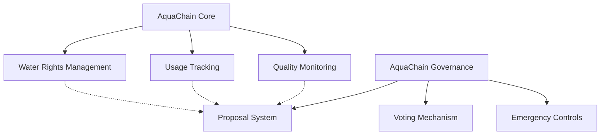

# AquaChain Water Resource Management

A blockchain-based platform for transparent and efficient management of water resources across communities, agricultural operations, and industrial users.

## Overview

AquaChain provides a decentralized solution for managing water rights, tracking usage, and governing water resources. The platform enables:

- Registration and management of water rights for different stakeholder types
- Transparent tracking of water consumption and quality measurements
- Trading of water rights between stakeholders
- Democratic governance of water resources through proposals and voting
- Emergency response mechanisms for drought conditions

## Architecture

The platform consists of two main smart contracts that work together to manage water resources:



### Core Components
- **aquachain-core.clar**: Handles water rights registration, transfers, usage tracking, and quality measurements
- **aquachain-governance.clar**: Manages stakeholder voting, proposals, and emergency responses

## Contract Documentation

### AquaChain Core Contract

Core functionality for water rights management:

#### Key Features:
- Stakeholder registration with different types (Agricultural, Residential, Industrial)
- Water rights allocation and tracking
- Usage recording and history
- Water quality measurements
- Emergency controls for drought conditions

#### Important Functions:
```clarity
(define-public (register-stakeholder (stakeholder-type uint))
(define-public (record-water-usage (amount uint))
(define-public (transfer-water-rights (recipient principal) (amount uint))
(define-public (report-water-quality (location (string-ascii 64)) (ph-level uint) (turbidity uint) (contaminants-level uint))
```

### AquaChain Governance Contract

Manages the democratic governance of water resources:

#### Key Features:
- Proposal creation and voting
- Stakeholder voting power calculation
- Emergency drought response
- Quorum and majority rules

#### Important Functions:
```clarity
(define-public (create-proposal (title (string-ascii 100)) (description (string-utf8 1000)) (proposal-type (string-ascii 50)) (voting-period uint) (emergency bool) (metadata (optional (string-utf8 1000))))
(define-public (vote (proposal-id uint) (vote-type (string-ascii 10)))
(define-public (finalize-proposal (proposal-id uint))
```

## Getting Started

### Prerequisites
- Clarinet
- Stacks blockchain development environment

### Installation
1. Clone the repository
2. Install dependencies
3. Deploy contracts using Clarinet

### Basic Usage

1. **Register as a Stakeholder**:
```clarity
(contract-call? .aquachain-core register-stakeholder STAKEHOLDER-AGRICULTURAL)
```

2. **Record Water Usage**:
```clarity
(contract-call? .aquachain-core record-water-usage u1000)
```

3. **Create a Governance Proposal**:
```clarity
(contract-call? .aquachain-governance create-proposal "Water Conservation" "Reduce allocation by 10%" "ALLOCATION" u1440 false none)
```

## Security Considerations

1. **Access Control**
- Only registered stakeholders can participate
- Administrative functions restricted to contract owner
- Emergency controls have additional verification

2. **Resource Limits**
- Water allocations tracked and enforced
- Trading requires sufficient balance
- Emergency reductions automatically applied

3. **Data Validation**
- All inputs validated before processing
- Quality measurements have range checks
- Proposal parameters verified

## Development

### Testing
Run the test suite using Clarinet:
```bash
clarinet test
```

### Local Development
1. Start Clarinet console:
```bash
clarinet console
```

2. Deploy contracts:
```clarity
(contract-call? .aquachain-core register-stakeholder STAKEHOLDER-AGRICULTURAL)
```

3. Interact with contracts through the console

The AquaChain system is designed for extensibility and can be integrated with IoT devices and external monitoring systems for automated data input and verification.